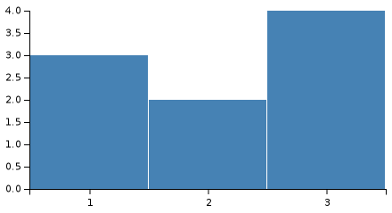
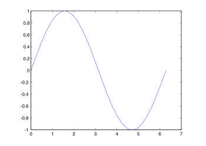
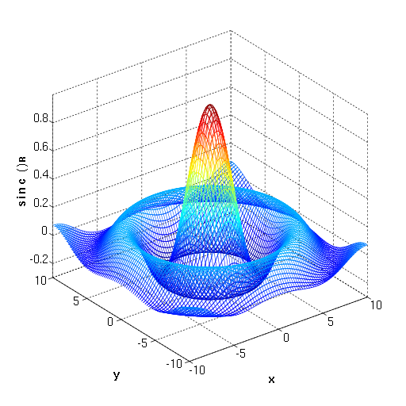
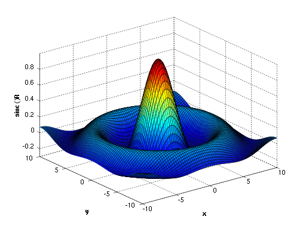

<strong>MATLAB</strong>&nbsp;(<em>matrix laboratory</em>) is a&nbsp;<a class="mw-redirect" title="Multi-paradigm programming language" href="https://en.wikipedia.org/wiki/Multi-paradigm_programming_language">multi-paradigm</a>&nbsp;<a title="Numerical analysis" href="https://en.wikipedia.org/wiki/Numerical_analysis">numerical computing</a>&nbsp;environment and&nbsp;<a class="mw-redirect" title="" href="https://en.wikipedia.org/wiki/Proprietary_programming_language">proprietary programming language</a>&nbsp;developed by&nbsp;<a title="MathWorks" href="https://en.wikipedia.org/wiki/MathWorks">MathWorks</a>. MATLAB allows&nbsp;<a title="Matrix (mathematics)" href="https://en.wikipedia.org/wiki/Matrix_(mathematics)">matrix</a>&nbsp;manipulations, plotting of&nbsp;<a title="Function (mathematics)" href="https://en.wikipedia.org/wiki/Function_(mathematics)">functions</a>&nbsp;and data, implementation of&nbsp;<a title="Algorithm" href="https://en.wikipedia.org/wiki/Algorithm">algorithms</a>, creation of&nbsp;<a title="User interface" href="https://en.wikipedia.org/wiki/User_interface">user interfaces</a>, and interfacing with programs written in other languages.

Although MATLAB is intended primarily for numerical computing, an optional toolbox uses the&nbsp;<a title="MuPAD" href="https://en.wikipedia.org/wiki/MuPAD">MuPAD</a>&nbsp;<a title="Computer algebra system" href="https://en.wikipedia.org/wiki/Computer_algebra_system">symbolic engine</a>&nbsp;allowing access to&nbsp;<a class="mw-redirect" title="Symbolic computing" href="https://en.wikipedia.org/wiki/Symbolic_computing">symbolic computing</a>&nbsp;abilities. An additional package,&nbsp;<a title="Simulink" href="https://en.wikipedia.org/wiki/Simulink">Simulink</a>, adds graphical multi-domain simulation and&nbsp;<a title="Model-based design" href="https://en.wikipedia.org/wiki/Model-based_design">model-based design</a>&nbsp;for&nbsp;<a title="Dynamical system" href="https://en.wikipedia.org/wiki/Dynamical_system">dynamic</a>&nbsp;and&nbsp;<a title="Embedded system" href="https://en.wikipedia.org/wiki/Embedded_system">embedded systems</a>.

As of 2018, MATLAB has more than 3 million users worldwide.&nbsp;MATLAB users come from various backgrounds of&nbsp;<a title="Engineering" href="https://en.wikipedia.org/wiki/Engineering">engineering</a>,&nbsp;<a title="Science" href="https://en.wikipedia.org/wiki/Science">science</a>, and&nbsp;<a title="Economics" href="https://en.wikipedia.org/wiki/Economics">economics</a>.

 

<table class="infobox vevent">
<tbody>
<tr>
<th scope="row"><a class="mw-redirect" title="" href="https://en.wikipedia.org/wiki/Software_developer">Developer(s)</a></th>
<td><a title="MathWorks" href="https://en.wikipedia.org/wiki/MathWorks">MathWorks</a></td>
</tr>
<tr>
<th scope="row">Initial release</th>
<td>1984; 36&nbsp;years ago</td>
</tr>
<tr>
<th scope="row"><a title="Software release life cycle" href="https://en.wikipedia.org/wiki/Software_release_life_cycle">Stable release</a></th>
<td>

R2020a / March&nbsp;19, 2020; 23 days ago

</td>
</tr>
<tr>
<th scope="row"><a title="Software release life cycle" href="https://en.wikipedia.org/wiki/Software_release_life_cycle">Preview release</a></th>
<td>R2020a Prerelease&nbsp;<a class="external text" href="https://en.wikipedia.org/w/index.php?title=Template:Latest_preview_software_release/MATLAB&amp;action=edit">[&plusmn;]</a></td>
</tr>
<tr>
<th scope="row">Written in</th>
<td><a title="C (programming language)" href="https://en.wikipedia.org/wiki/C_(programming_language)">C</a>/<a title="C++" href="https://en.wikipedia.org/wiki/C%2B%2B">C++</a>,&nbsp;<a title="Java (programming language)" href="https://en.wikipedia.org/wiki/Java_(programming_language)">Java</a></td>
</tr>
<tr>
<th scope="row"><a title="Operating system" href="https://en.wikipedia.org/wiki/Operating_system">Operating system</a></th>
<td><a title="Microsoft Windows" href="https://en.wikipedia.org/wiki/Microsoft_Windows">Windows</a>,&nbsp;<a title="MacOS" href="https://en.wikipedia.org/wiki/MacOS">macOS</a>, and&nbsp;<a title="Linux" href="https://en.wikipedia.org/wiki/Linux">Linux</a></td>
</tr>
<tr>
<th scope="row"><a title="Computing platform" href="https://en.wikipedia.org/wiki/Computing_platform">Platform</a></th>
<td><a title="IA-32" href="https://en.wikipedia.org/wiki/IA-32">IA-32</a>,&nbsp;<a title="X86-64" href="https://en.wikipedia.org/wiki/X86-64">x86-64</a></td>
</tr>
<tr>
<th scope="row"><a title="Software categories" href="https://en.wikipedia.org/wiki/Software_categories#Categorization_approaches">Type</a></th>
<td><a class="mw-redirect" title="List of numerical analysis software" href="https://en.wikipedia.org/wiki/List_of_numerical_analysis_software">Numerical computing</a></td>
</tr>
<tr>
<th scope="row"><a title="Software license" href="https://en.wikipedia.org/wiki/Software_license">License</a></th>
<td><a title="Proprietary software" href="https://en.wikipedia.org/wiki/Proprietary_software">Proprietary</a>&nbsp;<a title="Commercial software" href="https://en.wikipedia.org/wiki/Commercial_software">commercial software</a></td>
</tr>
<tr>
<th scope="row">Website</th>
<td><a class="external text" href="https://www.mathworks.com/products/matlab.html" rel="nofollow">mathworks.com</a></td>
</tr>
</tbody>
</table>

&nbsp;

<table class="infobox vevent" style="width: 555px;">
<tbody>
<tr>
<th style="width: 127px;" scope="row"><a title="" href="https://en.wikipedia.org/wiki/Programming_paradigm">Paradigm</a></th>
<td style="width: 414px;"><a class="mw-redirect" title="Multi-paradigm programming language" href="https://en.wikipedia.org/wiki/Multi-paradigm_programming_language">multi-paradigm</a>:&nbsp;<a title="Functional programming" href="https://en.wikipedia.org/wiki/Functional_programming">functional</a>,&nbsp;<a title="Imperative programming" href="https://en.wikipedia.org/wiki/Imperative_programming">imperative</a>,&nbsp;<a title="Procedural programming" href="https://en.wikipedia.org/wiki/Procedural_programming">procedural</a>,&nbsp;<a title="Object-oriented programming" href="https://en.wikipedia.org/wiki/Object-oriented_programming">object-oriented</a>,&nbsp;<a title="Array programming" href="https://en.wikipedia.org/wiki/Array_programming">array</a></td>
</tr>
<tr>
<th style="width: 127px;" scope="row"><a title="Software design" href="https://en.wikipedia.org/wiki/Software_design">Designed&nbsp;by</a></th>
<td style="width: 414px;"><a title="Cleve Moler" href="https://en.wikipedia.org/wiki/Cleve_Moler">Cleve Moler</a></td>
</tr>
<tr>
<th style="width: 127px;" scope="row"><a class="mw-redirect" title="Software developer" href="https://en.wikipedia.org/wiki/Software_developer">Developer</a></th>
<td class="organiser" style="width: 414px;"><a title="MathWorks" href="https://en.wikipedia.org/wiki/MathWorks">MathWorks</a></td>
</tr>
<tr>
<th style="width: 127px;" scope="row">First&nbsp;appeared</th>
<td style="width: 414px;">late 1970s</td>
</tr>
<tr>
<td style="width: 541px;" colspan="2">&nbsp;</td>
</tr>
<tr>
<th style="width: 127px;" scope="row"><a title="Software release life cycle" href="https://en.wikipedia.org/wiki/Software_release_life_cycle">Stable release</a></th>
<td style="width: 414px;">

9.7 (R2019b) / September&nbsp;11, 2019; 7 months ago

</td>
</tr>
<tr>
<th style="width: 127px;" scope="row"><a title="Software release life cycle" href="https://en.wikipedia.org/wiki/Software_release_life_cycle">Preview release</a></th>
<td style="width: 414px;">R2020a Prerelease&nbsp;<a class="external text" href="https://en.wikipedia.org/w/index.php?title=Template:Latest_preview_software_release/MATLAB&amp;action=edit">[&plusmn;]</a></td>
</tr>
<tr>
<th style="width: 127px;" scope="row"><a title="Type system" href="https://en.wikipedia.org/wiki/Type_system">Typing discipline</a></th>
<td style="width: 414px;"><a class="mw-redirect" title="Dynamic typing" href="https://en.wikipedia.org/wiki/Dynamic_typing">dynamic</a>,&nbsp;<a class="mw-redirect" title="Weak typing" href="https://en.wikipedia.org/wiki/Weak_typing">weak</a></td>
</tr>
<tr>
<th style="width: 127px;" scope="row"><a title="Filename extension" href="https://en.wikipedia.org/wiki/Filename_extension">Filename extensions</a></th>
<td style="width: 414px;">.m, .p, .mex*, .mat, .fig, .mlx, .mlapp, .mltbx, .mlappinstall, .mlpkginstall</td>
</tr>
<tr>
<th style="width: 127px;" scope="row">Website</th>
<td style="width: 414px;"><a class="external text" href="https://www.mathworks.com/products/matlab.html" rel="nofollow">mathworks.com</a></td>
</tr>
<tr>
<th style="width: 541px;" colspan="2">Influenced by</th>
</tr>
<tr>
<td style="width: 541px;" colspan="2">

<ul>
<li><a title="APL (programming language)" href="https://en.wikipedia.org/wiki/APL_(programming_language)">APL</a></li>
<li><a title="EISPACK" href="https://en.wikipedia.org/wiki/EISPACK">EISPACK</a></li>
<li><a title="LINPACK" href="https://en.wikipedia.org/wiki/LINPACK">LINPACK</a></li>
<li><a title="PL/0" href="https://en.wikipedia.org/wiki/PL/0">PL/0</a></li>
<li><a title="Speakeasy (computational environment)" href="https://en.wikipedia.org/wiki/Speakeasy_(computational_environment)">Speakeasy</a></li>
</ul>

</td>
</tr>
<tr>
<th style="width: 541px;" colspan="2">Influenced</th>
</tr>
<tr>
<td style="width: 541px;" colspan="2">

<ul>
<li><a title="Julia (programming language)" href="https://en.wikipedia.org/wiki/Julia_(programming_language)">Julia</a></li>
<li><a title="GNU Octave" href="https://en.wikipedia.org/wiki/GNU_Octave">Octave</a></li>
<li><a title="Scilab" href="https://en.wikipedia.org/wiki/Scilab">Scilab</a></li>
</ul>

</td>
</tr>
<tr>
<td class="hlist" style="width: 541px;" colspan="2">
<ul>
<li>&nbsp;<a class="extiw" title="wikibooks:MATLAB Programming" href="https://en.wikibooks.org/wiki/MATLAB_Programming">MATLAB Programming</a>&nbsp;at Wikibooks</li>
</ul>
</td>
</tr>
</tbody>
</table>
 

<h2 id="mw-toc-heading">Contents</h2>
<label class="toctogglelabel" for="toctogglecheckbox"></label>

<ul>
<li class="toclevel-1 tocsection-1"><a href="#History">History</a></li>
<li class="toclevel-1 tocsection-2"><a href="#Syntax">Syntax</a>
<ul>
<li class="toclevel-2 tocsection-3"><a href="#Variables">Variables</a></li>
<li class="toclevel-2 tocsection-4"><a href="#Vectors_and_matrices">Vectors and matrices</a></li>
<li class="toclevel-2 tocsection-5"><a href="#Structures">Structures</a></li>
<li class="toclevel-2 tocsection-6"><a href="#Functions">Functions</a></li>
<li class="toclevel-2 tocsection-7"><a href="#Function_handles">Function handles</a></li>
<li class="toclevel-2 tocsection-8"><a href="#Classes_and_object-oriented_programming">Classes and object-oriented programming</a></li>
</ul>
</li>
<li class="toclevel-1 tocsection-9"><a href="#Graphics_and_graphical_user_interface_programming">Graphics and graphical user interface programming</a></li>
<li class="toclevel-1 tocsection-10"><a href="#Interfacing_with_other_languages">Interfacing with other languages</a></li>
<li class="toclevel-1 tocsection-11"><a href="#Alternatives">Alternatives</a></li>
<li class="toclevel-1 tocsection-12"><a href="#Release_history">Release history</a></li>
<li class="toclevel-1 tocsection-13"><a href="#Books">Books</a></li>
</ul>

 
<h2>History</h2>

<a title="Cleve Moler" href="https://en.wikipedia.org/wiki/Cleve_Moler">Cleve Moler</a>, the chairman of the&nbsp;<a title="Computer science" href="https://en.wikipedia.org/wiki/Computer_science">computer science</a>&nbsp;department at the&nbsp;<a title="University of New Mexico" href="https://en.wikipedia.org/wiki/University_of_New_Mexico">University of New Mexico</a>, started developing MATLAB in the late 1970s.&nbsp;He designed it to give his students access to&nbsp;<a title="LINPACK" href="https://en.wikipedia.org/wiki/LINPACK">LINPACK</a>&nbsp;and&nbsp;<a title="EISPACK" href="https://en.wikipedia.org/wiki/EISPACK">EISPACK</a>&nbsp;without them having to learn&nbsp;<a title="Fortran" href="https://en.wikipedia.org/wiki/Fortran">Fortran</a>. It soon spread to other universities and found a strong audience within the&nbsp;<a title="Applied mathematics" href="https://en.wikipedia.org/wiki/Applied_mathematics">applied mathematics</a>&nbsp;community.&nbsp;<a title="John N. Little" href="https://en.wikipedia.org/wiki/John_N._Little">Jack Little</a>, an engineer, was exposed to it during a visit Moler made to&nbsp;<a title="Stanford University" href="https://en.wikipedia.org/wiki/Stanford_University">Stanford University</a>&nbsp;in 1983. Recognizing its commercial potential, he joined with Moler and Steve Bangert. They rewrote MATLAB in&nbsp;<a title="C (programming language)" href="https://en.wikipedia.org/wiki/C_(programming_language)">C</a>&nbsp;and founded&nbsp;<a title="MathWorks" href="https://en.wikipedia.org/wiki/MathWorks">MathWorks</a>&nbsp;in 1984 to continue its development. These rewritten libraries were known as JACKPAC.&nbsp;In 2000, MATLAB was rewritten to use a newer set of libraries for matrix manipulation,&nbsp;<a title="LAPACK" href="https://en.wikipedia.org/wiki/LAPACK">LAPACK</a>.

MATLAB was first adopted by researchers and practitioners in&nbsp;<a title="Control engineering" href="https://en.wikipedia.org/wiki/Control_engineering">control engineering</a>, Little's specialty, but quickly spread to many other domains. It is now also used in education, in particular the teaching of&nbsp;<a title="Linear algebra" href="https://en.wikipedia.org/wiki/Linear_algebra">linear algebra</a>&nbsp;and&nbsp;<a title="Numerical analysis" href="https://en.wikipedia.org/wiki/Numerical_analysis">numerical analysis</a>, and is popular amongst scientists involved in&nbsp;<a class="mw-redirect" title="Image processing" href="https://en.wikipedia.org/wiki/Image_processing">image processing</a>.

<h2>Syntax</h2>

The MATLAB application is built around the MATLAB programming language. Common usage of the MATLAB application involves using the "Command Window" as an interactive mathematical&nbsp;<a class="mw-redirect" title="Command line interface" href="https://en.wikipedia.org/wiki/Command_line_interface">shell</a>&nbsp;or executing text files containing MATLAB code.

<h3>Variables</h3>

Variables are defined using the assignment operator,&nbsp;<code>=</code>. MATLAB is a&nbsp;<a title="Strong and weak typing" href="https://en.wikipedia.org/wiki/Strong_and_weak_typing">weakly typed</a>&nbsp;programming language because types are implicitly converted.&nbsp;It is an inferred typed language because variables can be assigned without declaring their type, except if they are to be treated as symbolic objects,&nbsp;and that their type can change. Values can come from&nbsp;<a class="mw-redirect" title="Constant (computer science)" href="https://en.wikipedia.org/wiki/Constant_(computer_science)">constants</a>, from computation involving values of other variables, or from the output of a function. For example:

<pre>&gt;&gt; x = 17
x =
 17

&gt;&gt; x = 'hat'
x =
hat

&gt;&gt; x = [3*4, pi/2]
x =
   12.0000    1.5708

&gt;&gt; y = 3*sin(x)
y =
   -1.6097    3.0000
</pre>

<h3>Vectors and matrices</h3>

A simple array is defined using the colon syntax:&nbsp;<em>initial</em><code>:</code><em>increment</em><code>:</code><em>terminator</em>. For instance:

<pre>&gt;&gt; array = 1:2:9
array =
 1 3 5 7 9
</pre>

defines a variable named&nbsp;<code>array</code>&nbsp;(or assigns a new value to an existing variable with the name&nbsp;<code>array</code>) which is an array consisting of the values 1, 3, 5, 7, and 9. That is, the array starts at 1 (the&nbsp;<em>initial</em>&nbsp;value), increments with each step from the previous value by 2 (the&nbsp;<em>increment</em>&nbsp;value), and stops once it reaches (or to avoid exceeding) 9 (the&nbsp;<em>terminator</em>&nbsp;value).

<pre>&gt;&gt; array = 1:3:9
array =
 1 4 7
</pre>

the&nbsp;<em>increment</em>&nbsp;value can actually be left out of this syntax (along with one of the colons), to use a default value of 1.

<pre>&gt;&gt; ari = 1:5
ari =
 1 2 3 4 5
</pre>

assigns to the variable named&nbsp;<code>ari</code>&nbsp;an array with the values 1, 2, 3, 4, and 5, since the default value of 1 is used as the increment.

<a class="mw-redirect" title="One-based indexing" href="https://en.wikipedia.org/wiki/One-based_indexing">Indexing</a>&nbsp;is one-based,&nbsp;which is the usual convention for&nbsp;<a title="Matrix (mathematics)" href="https://en.wikipedia.org/wiki/Matrix_(mathematics)">matrices</a>&nbsp;in mathematics, unlike zero-based indexing commonly used in other programming languages such as C, C++, and Java.

Matrices can be defined by separating the elements of a row with blank space or comma and using a semicolon to terminate each row. The list of elements should be surrounded by square brackets&nbsp;<code>[]</code>. Parentheses&nbsp;<code>()</code>&nbsp;are used to access elements and subarrays (they are also used to denote a function argument list).

<pre>&gt;&gt; A = [16 3 2 13; 5 10 11 8; 9 6 7 12; 4 15 14 1]
A =
 16  3  2 13
  5 10 11  8
  9  6  7 12
  4 15 14  1

&gt;&gt; A(2,3)
ans =
 11
</pre>

Sets of indices can be specified by expressions such as&nbsp;<code>2:4</code>, which evaluates to&nbsp;<code>[2, 3, 4]</code>. For example, a submatrix taken from rows 2 through 4 and columns 3 through 4 can be written as:

<pre>&gt;&gt; A(2:4,3:4)
ans =
 11 8
 7 12
 14 1
</pre>

A square&nbsp;<a title="Identity matrix" href="https://en.wikipedia.org/wiki/Identity_matrix">identity matrix</a>&nbsp;of size&nbsp;<em>n</em>&nbsp;can be generated using the function&nbsp;<code>eye</code>, and matrices of any size with zeros or ones can be generated with the functions&nbsp;<code>zeros</code>&nbsp;and&nbsp;<code>ones</code>, respectively.

<pre>&gt;&gt; eye(3,3)
ans =
 1 0 0
 0 1 0
 0 0 1

&gt;&gt; zeros(2,3)
ans =
 0 0 0
 0 0 0

&gt;&gt; ones(2,3)
ans =
 1 1 1
 1 1 1
</pre>

<a title="Transpose" href="https://en.wikipedia.org/wiki/Transpose">Transposing</a>&nbsp;a vector or a matrix is done either by the function&nbsp;<code>transpose</code>&nbsp;or by adding dot-prime after the matrix (without the dot, prime will perform&nbsp;<a title="Conjugate transpose" href="https://en.wikipedia.org/wiki/Conjugate_transpose">conjugate transpose</a>&nbsp;for complex arrays):

<pre>&gt;&gt; A = [1 ; 2],  B = A.', C = transpose(A)
A =
     1
     2
B =
     1     2
C =
     1     2

&gt;&gt; D = [0 3 ; 1 5], D.'
D =
     0     3
     1     5
ans =
     0     1
     3     5
</pre>

Most functions accept arrays as input and operate element-wise on each element. For example,&nbsp;<code>mod(2*J,n)</code>&nbsp;will multiply every element in&nbsp;<em>J</em>&nbsp;by 2, and then reduce each element modulo&nbsp;<em>n</em>. MATLAB does include standard&nbsp;<code>for</code>&nbsp;and&nbsp;<code>while</code>&nbsp;loops, but (as in other similar applications such as&nbsp;<a title="R (programming language)" href="https://en.wikipedia.org/wiki/R_(programming_language)">R</a>), using the&nbsp;<a title="Array programming" href="https://en.wikipedia.org/wiki/Array_programming">vectorized</a>&nbsp;notation is encouraged and is often faster to execute. The following code, excerpted from the function&nbsp;<em>magic.m</em>, creates a&nbsp;<a title="Magic square" href="https://en.wikipedia.org/wiki/Magic_square">magic square</a>&nbsp;<em>M</em>&nbsp;for odd values of&nbsp;<em>n</em>&nbsp;(MATLAB function&nbsp;<code>meshgrid</code>&nbsp;is used here to generate square matrices&nbsp;<em>I</em>&nbsp;and&nbsp;<em>J</em>&nbsp;containing&nbsp;<em>1:n</em>).

<pre>[J,I] = meshgrid(1:n);
A = mod(I + J - (n + 3) / 2, n);
B = mod(I + 2 * J - 2, n);
M = n * A + B + 1;
</pre>

<h3>Structures</h3>

MATLAB supports structure data types.&nbsp;Since all variables in MATLAB are arrays, a more adequate name is "structure array", where each element of the array has the same field names. In addition, MATLAB supports dynamic field names&nbsp;(field look-ups by name, field manipulations, etc.).

<h3>Functions</h3>

When creating a MATLAB function, the name of the file should match the name of the first function in the file. Valid function names begin with an alphabetic character, and can contain letters, numbers, or underscores. Variables and functions are case sensitive.

<h3>Function handles</h3>

MATLAB supports elements of&nbsp;<a title="Lambda calculus" href="https://en.wikipedia.org/wiki/Lambda_calculus">lambda calculus</a>&nbsp;by introducing function handles,&nbsp;or function references, which are implemented either in .m files or anonymous /nested functions.

<h3>Classes and object-oriented programming</h3>

MATLAB supports&nbsp;<a title="Object-oriented programming" href="https://en.wikipedia.org/wiki/Object-oriented_programming">object-oriented programming</a>&nbsp;including classes, inheritance, virtual dispatch, packages, pass-by-value semantics, and pass-by-reference semantics.&nbsp;However, the syntax and calling conventions are significantly different from other languages. MATLAB has value classes and reference classes, depending on whether the class has&nbsp;<em>handle</em>&nbsp;as a super-class (for reference classes) or not (for value classes).

Method call behavior is different between value and reference classes. For example, a call to a method

<pre>object.method();
</pre>

can alter any member of&nbsp;<em>object</em>&nbsp;only if&nbsp;<em>object</em>&nbsp;is an instance of a reference class, otherwise value class methods must return a new instance if it needs to modify the object.

An example of a simple class is provided below.

<pre>classdef Hello
    methods
        function greet(obj)
            disp('Hello!')
        end
    end
end
</pre>

When put into a file named&nbsp;<tt>hello.m</tt>, this can be executed with the following commands:

<pre>&gt;&gt; x = Hello();
&gt;&gt; x.greet();
Hello!</pre>

<h2>Graphics and graphical user interface programming</h2>
<ul>
<li>

</li>
</ul>

MATLAB has tightly integrated graph-plotting features. For example, the function&nbsp;<em>plot</em>&nbsp;can be used to produce a graph from two vectors&nbsp;<em>x</em>&nbsp;and&nbsp;<em>y</em>. The code:

<pre>x = 0:pi/100:2*pi;
y = sin(x);
plot(x,y)
</pre>

produces the following figure of the&nbsp;<a title="Sine wave" href="https://en.wikipedia.org/wiki/Sine_wave">sine function</a>:

MATLAB supports three-dimensional graphics as well:

<table>
<tbody>
<tr>
<td valign="top">

<pre>[X,Y] = meshgrid(-10:0.25:10,-10:0.25:10);
f = sinc(sqrt((X/pi).^2+(Y/pi).^2));
mesh(X,Y,f);
axis([-10 10 -10 10 -0.3 1])
xlabel('{\bfx}')
ylabel('{\bfy}')
zlabel('{\bfsinc} ({\bfR})')
hidden off
</pre>

</td>
<td>&nbsp;&nbsp;&nbsp;</td>
<td valign="top">

<pre>[X,Y] = meshgrid(-10:0.25:10,-10:0.25:10);
f = sinc(sqrt((X/pi).^2+(Y/pi).^2));
surf(X,Y,f);
axis([-10 10 -10 10 -0.3 1])
xlabel('{\bfx}')
ylabel('{\bfy}')
zlabel('{\bfsinc} ({\bfR})')
</pre>

</td>
</tr>
<tr>
<td>This code produces a&nbsp;<strong><a class="mw-redirect" title="Wire frame model" href="https://en.wikipedia.org/wiki/Wire_frame_model">wireframe</a></strong>&nbsp;3D plot of the two-dimensional unnormalized&nbsp;<a title="Sinc function" href="https://en.wikipedia.org/wiki/Sinc_function">sinc function</a>:</td>
<td>&nbsp;&nbsp;&nbsp;</td>
<td>This code produces a&nbsp;<strong>surface</strong>&nbsp;3D plot of the two-dimensional unnormalized&nbsp;<a title="Sinc function" href="https://en.wikipedia.org/wiki/Sinc_function">sinc function</a>:</td>
</tr>
<tr>
<td></td>
<td>&nbsp;&nbsp;&nbsp;</td>
<td></td>
</tr>
</tbody>
</table>

MATLAB supports developing&nbsp;<a title="Graphical user interface" href="https://en.wikipedia.org/wiki/Graphical_user_interface">graphical user interface</a>&nbsp;(GUI) applications.&nbsp;UIs can be generated either programmatically or using visual design environments such as&nbsp;<em>GUIDE</em>&nbsp;and&nbsp;<em>App Designer</em>.

 

<h2 id= "Books">Books </h2>

<ul>
                <li><a target="_blank" href="https://github.com/manjunath5496/MATLAB-Books/blob/master/mta(1).pdf" style="text-decoration:none;">Advanced Engineering Mathematics with MATLAB  </a></li>
                <li><a target="_blank" href="https://github.com/manjunath5496/MATLAB-Books/blob/master/mta(2).pdf" style="text-decoration:none;">An Engineer's Guide to MATLAB</a></li>
                <li><a target="_blank" href="https://github.com/manjunath5496/MATLAB-Books/blob/master/mta(3).pdf" style="text-decoration:none;">Applied Numerical Methods Using MATLAB</a></li>
                <li><a target="_blank" href="https://github.com/manjunath5496/MATLAB-Books/blob/master/mta(4).pdf" style="text-decoration:none;">MATLAB: Creating Graphical User Interfaces</a></li>
                <li><a target="_blank" href="https://github.com/manjunath5496/MATLAB-Books/blob/master/mta(5).pdf" style="text-decoration:none;">Applied Numerical Methods with MATLAB for Engineers and Scientists</a></li>
                <li><a target="_blank" href="https://github.com/manjunath5496/MATLAB-Books/blob/master/mta(6).pdf" style="text-decoration:none;">Circuit Analysis II with MATLAB Applications</a></li>
                <li><a target="_blank" href="https://github.com/manjunath5496/MATLAB-Books/blob/master/mta(7).pdf" style="text-decoration:none;">MATLAB: Data Analysis</a></li>
                <li><a target="_blank" href="https://github.com/manjunath5496/MATLAB-Books/blob/master/mta(8).pdf" style="text-decoration:none;">Differential Equations with MATLAB</a></li>
                <li><a target="_blank" href="https://github.com/manjunath5496/MATLAB-Books/blob/master/mta(9).pdf" style="text-decoration:none;">Digital Signal Processing for Medical Imaging Using Matlab</a></li>
                <li><a target="_blank" href="https://github.com/manjunath5496/MATLAB-Books/blob/master/mta(10).rar" style="text-decoration:none;">Dynamical Systems with Applications using MATLAB</a></li>
	  <li><a target="_blank" href="https://github.com/manjunath5496/MATLAB-Books/blob/master/mta(11).pdf" style="text-decoration:none;"> An Introduction to Partial Differential Equations with MATLAB </a></li>
                <li><a target="_blank" href="https://github.com/manjunath5496/MATLAB-Books/blob/master/mta(12).pdf" style="text-decoration:none;">Experiments with MATLAB</a></li>
                <li><a target="_blank" href="https://github.com/manjunath5496/MATLAB-Books/blob/master/mta(13).pdf" style="text-decoration:none;">Exploratory Data Analysis with MATLAB</a></li>
                <li><a target="_blank" href="https://github.com/manjunath5496/MATLAB-Books/blob/master/mta(14).pdf" style="text-decoration:none;">Fundamentals of Electromagnetics with Matlab</a></li>
                <li><a target="_blank" href="https://github.com/manjunath5496/MATLAB-Books/blob/master/mta(15).pdf" style="text-decoration:none;">MATLAB Graphics</a></li>
                <li><a target="_blank" href="https://github.com/manjunath5496/MATLAB-Books/blob/master/mta(16).pdf" style="text-decoration:none;">Introduction to Random Signals and Applied Kalman Filtering with Matlab Exercises</a></li>
                <li><a target="_blank" href="https://github.com/manjunath5496/MATLAB-Books/blob/master/mta(17).pdf" style="text-decoration:none;">Learning to Program with MATLAB</a></li>
                <li><a target="_blank" href="https://github.com/manjunath5496/MATLAB-Books/blob/master/mta(18).pdf" style="text-decoration:none;">Linear Feedback Control: Analysis and Design with MATLAB</a></li>
                <li><a target="_blank" href="https://github.com/manjunath5496/MATLAB-Books/blob/master/mta(19).pdf" style="text-decoration:none;">MATLAB: The Language of Technical Computing</a></li>
                <li><a target="_blank" href="https://github.com/manjunath5496/MATLAB-Books/blob/master/mta(20).pdf" style="text-decoration:none;">MATLAB Deep Learning</a></li>	
	
 <li><a target="_blank" href="https://github.com/manjunath5496/MATLAB-Books/blob/master/mta(21).pdf" style="text-decoration:none;">MATLAB Graphical Programming: Practical Hands-on MATLAB Solutions</a></li>
	
<li><a target="_blank" href="https://github.com/manjunath5496/MATLAB-Books/blob/master/mta(22).pdf" style="text-decoration:none;">MATLAB Machine Learning</a></li>
  <li><a target="_blank" href="https://github.com/manjunath5496/MATLAB-Books/blob/master/mta(23).pdf" style="text-decoration:none;">MATLAB Machine Learning Recipes</a></li>
 <li><a target="_blank" href="https://github.com/manjunath5496/MATLAB-Books/blob/master/mta(24).pdf" style="text-decoration:none;">MATLAB Optimization Techniques</a></li>	
	
 <li><a target="_blank" href="https://github.com/manjunath5496/MATLAB-Books/blob/master/mta(25).pdf" style="text-decoration:none;">Matlab: A Practical Introduction to Programming and Problem Solving</a></li>
	
	
 <li><a target="_blank" href="https://github.com/manjunath5496/MATLAB-Books/blob/master/mta(26).pdf" style="text-decoration:none;">MATLAB: An Introduction with Applications </a></li>
	
<li><a target="_blank" href="https://github.com/manjunath5496/MATLAB-Books/blob/master/mta(27).pdf" style="text-decoration:none;">MATLAB Codes for Finite Element Analysis</a></li>
  <li><a target="_blank" href="https://github.com/manjunath5496/MATLAB-Books/blob/master/mta(28).pdf" style="text-decoration:none;">MATLAB Demystified</a></li>
 <li><a target="_blank" href="https://github.com/manjunath5496/MATLAB-Books/blob/master/mta(29).pdf" style="text-decoration:none;">MATLAB: Object-Oriented Programming</a></li>	
	
 <li><a target="_blank" href="https://github.com/manjunath5496/MATLAB-Books/blob/master/mta(30).pdf" style="text-decoration:none;">MATLAB: Programming Fundamentals</a></li>
	
 <li><a target="_blank" href="https://github.com/manjunath5496/MATLAB-Books/blob/master/mta(31).pdf" style="text-decoration:none;">MATLAB: Mathematics</a></li>
	
<li><a target="_blank" href="https://github.com/manjunath5496/MATLAB-Books/blob/master/mta(32).pdf" style="text-decoration:none;">MATLAB Recipes for Earth Sciences </a></li>
	
<li><a target="_blank" href="https://github.com/manjunath5496/MATLAB-Books/blob/master/mta(33).pdf" style="text-decoration:none;">Algorithm Collections for Digital Signal Processing Applications Using Matlab</a></li>
  <li><a target="_blank" href="https://github.com/manjunath5496/MATLAB-Books/blob/master/mta(34).pdf" style="text-decoration:none;">MATLAB For Dummies</a></li>
 <li><a target="_blank" href="https://github.com/manjunath5496/MATLAB-Books/blob/master/mta(35).pdf" style="text-decoration:none;">Mechanisms and Robots Analysis with MATLAB</a></li>	
	
 <li><a target="_blank" href="https://github.com/manjunath5496/MATLAB-Books/blob/master/mta(36).pdf" style="text-decoration:none;">Modeling of Photovoltaic Systems Using MATLAB</a></li>
	
 <li><a target="_blank" href="https://github.com/manjunath5496/MATLAB-Books/blob/master/mta(37).pdf" style="text-decoration:none;">Multivariable Calculus with MATLAB</a></li>
	
<li><a target="_blank" href="https://github.com/manjunath5496/MATLAB-Books/blob/master/mta(38).pdf" style="text-decoration:none;">Numerical Linear Algebra: A Concise Introduction with MATLAB and Julia </a></li>
	
<li><a target="_blank" href="https://github.com/manjunath5496/MATLAB-Books/blob/master/mta(39).pdf" style="text-decoration:none;">Optical Fiber Communications Systems: Theory and Practice with MATLAB and Simulink Models</a></li>
  <li><a target="_blank" href="https://github.com/manjunath5496/MATLAB-Books/blob/master/mta(40).pdf" style="text-decoration:none;">Pattern Recognition</a></li>
 <li><a target="_blank" href="https://github.com/manjunath5496/MATLAB-Books/blob/master/mta(41).pdf" style="text-decoration:none;">Physics of Oscillations and Waves: With use of Matlab and Python</a></li>	
	
 <li><a target="_blank" href="https://github.com/manjunath5496/MATLAB-Books/blob/master/mta(42).pdf" style="text-decoration:none;">Practical Biomedical Signal Analysis Using MATLAB</a></li>
	
 <li><a target="_blank" href="https://github.com/manjunath5496/MATLAB-Books/blob/master/mta(43).pdf" style="text-decoration:none;">Practical MATLAB Applications for Engineers</a></li>
	

  <li><a target="_blank" href="https://github.com/manjunath5496/MATLAB-Books/blob/master/mta(44).pdf" style="text-decoration:none;">Programming for Computations – MATLAB/Octave</a></li>
 <li><a target="_blank" href="https://github.com/manjunath5496/MATLAB-Books/blob/master/mta(45).pdf" style="text-decoration:none;">Numerical Analysis Using MATLAB and Spreadsheets</a></li>	
	
 <li><a target="_blank" href="https://github.com/manjunath5496/MATLAB-Books/blob/master/mta(46).pdf" style="text-decoration:none;">Radar Systems Analysis and Design Using MATLAB</a></li>
	
 <li><a target="_blank" href="https://github.com/manjunath5496/MATLAB-Books/blob/master/mta(47).pdf" style="text-decoration:none;">Scientific Computing with MATLAB and Octave</a></li>
	

  <li><a target="_blank" href="https://github.com/manjunath5496/MATLAB-Books/blob/master/mta(48).pdf" style="text-decoration:none;">Simulation of ODE/PDE Models with MATLAB, OCTAVE and SCILAB</a></li>
 <li><a target="_blank" href="https://github.com/manjunath5496/MATLAB-Books/blob/master/mta(49).pdf" style="text-decoration:none;">Computational Nanotechnology Modeling and Applications with MATLAB</a></li>	
	
 <li><a target="_blank" href="https://github.com/manjunath5496/MATLAB-Books/blob/master/mta(50).pdf" style="text-decoration:none;">Fundamentals of Bioinformatics and Computational Biology: Methods and Exercises in MATLAB</a></li>
	
 <li><a target="_blank" href="https://github.com/manjunath5496/MATLAB-Books/blob/master/mta(51).pdf" style="text-decoration:none;">Introductory Quantum Mechanics with MATLAB</a></li>
	
	
 <li><a target="_blank" href="https://github.com/manjunath5496/MATLAB-Books/blob/master/mta(52).pdf" style="text-decoration:none;">Mastering MATLAB</a></li>
	
 <li><a target="_blank" href="https://github.com/manjunath5496/MATLAB-Books/blob/master/mta(53).pdf" style="text-decoration:none;">MATLAB Matrix Algebra</a></li>

 <li><a target="_blank" href="https://github.com/manjunath5496/MATLAB-Books/blob/master/mta(54).pdf" style="text-decoration:none;">Model Predictive Control System Design and Implementation Using MATLAB</a></li>

	
 <li><a target="_blank" href="https://github.com/manjunath5496/MATLAB-Books/blob/master/mta(55).pdf" style="text-decoration:none;">Smart Antennas with MATLAB</a></li>
	
	
 <li><a target="_blank" href="https://github.com/manjunath5496/MATLAB-Books/blob/master/mta(56).pdf" style="text-decoration:none;">Mathematics for Business, Science, and Technology with MATLAB and Excel Computations</a></li>
	
 <li><a target="_blank" href="https://github.com/manjunath5496/MATLAB-Books/blob/master/mta(57).pdf" style="text-decoration:none;">Understanding Digital Signal Processing with MATLAB and Solutions</a></li>

 <li><a target="_blank" href="https://github.com/manjunath5496/MATLAB-Books/blob/master/mta(58).pdf" style="text-decoration:none;">Understanding LTE with MATLAB: From Mathematical Modeling to Simulation and Prototyping</a></li>

 <li><a target="_blank" href="https://github.com/manjunath5496/MATLAB-Books/blob/master/mta(59).pdf" style="text-decoration:none;">Variational methods for engineers with Matlab</a></li>
	
	
 <li><a target="_blank" href="https://github.com/manjunath5496/MATLAB-Books/blob/master/mta(60).pdf" style="text-decoration:none;">Virtual Reality and Animation for MATLAB and Simulink Users</a></li>
	
 <li><a target="_blank" href="https://github.com/manjunath5496/MATLAB-Books/blob/master/mta(61).pdf" style="text-decoration:none;">Mathematical Methods for Mechanics: A Handbook with MATLAB Experiments</a></li>

 <li><a target="_blank" href="https://github.com/manjunath5496/MATLAB-Books/blob/master/mta(62).pdf" style="text-decoration:none;">Matlab by Example</a></li>

 <li><a target="_blank" href="https://github.com/manjunath5496/MATLAB-Books/blob/master/mta(63).pdf" style="text-decoration:none;">MATLAB Differential and Integral Calculus</a></li>
	
	
 <li><a target="_blank" href="https://github.com/manjunath5496/MATLAB-Books/blob/master/mta(64).pdf" style="text-decoration:none;">MATLAB for Beginners: A Gentle Approach</a></li>
	
 <li><a target="_blank" href="https://github.com/manjunath5496/MATLAB-Books/blob/master/mta(65).pdf" style="text-decoration:none;">MATLAB Guide to Finite Elements</a></li>

 <li><a target="_blank" href="https://github.com/manjunath5496/MATLAB-Books/blob/master/mta(66).pdf" style="text-decoration:none;">Applied Speech and Audio Processing: With MATLAB Examples</a></li>

 <li><a target="_blank" href="https://github.com/manjunath5496/MATLAB-Books/blob/master/mta(67).pdf" style="text-decoration:none;">Computational Intelligence Paradigms: Theory and Applications Using MATLAB</a></li>
	
	
 <li><a target="_blank" href="https://github.com/manjunath5496/MATLAB-Books/blob/master/mta(68).pdf" style="text-decoration:none;">Electronic Devices and Amplifier Circuits with MATLAB Computing</a></li>
	
 <li><a target="_blank" href="https://github.com/manjunath5496/MATLAB-Books/blob/master/mta(69).pdf" style="text-decoration:none;">Exploratory Data Analysis with MATLAB</a></li>

 <li><a target="_blank" href="https://github.com/manjunath5496/MATLAB-Books/blob/master/mta(70).pdf" style="text-decoration:none;">Fuzzy Image Processing and Applications with MATLAB</a></li>

 <li><a target="_blank" href="https://github.com/manjunath5496/MATLAB-Books/blob/master/mta(71).pdf" style="text-decoration:none;">Linear Control Systems with solved problems and MATLAB examples</a></li>

 <li><a target="_blank" href="https://github.com/manjunath5496/MATLAB-Books/blob/master/mta(72).rar" style="text-decoration:none;">Magnetics, Dielectrics, and Wave Propagation with MATLAB Codes</a></li>

 <li><a target="_blank" href="https://github.com/manjunath5496/MATLAB-Books/blob/master/mta(73).pdf" style="text-decoration:none;">Engineering Optics with MATLAB</a></li>
	
 <li><a target="_blank" href="https://github.com/manjunath5496/MATLAB-Books/blob/master/mta(74).pdf" style="text-decoration:none;">Essential MATLAB for Engineers and Scientists</a></li>

 <li><a target="_blank" href="https://github.com/manjunath5496/MATLAB-Books/blob/master/mta(75).pdf" style="text-decoration:none;">MATLAB Primer</a></li>

 <li><a target="_blank" href="https://github.com/manjunath5496/MATLAB-Books/blob/master/mta(76).pdf" style="text-decoration:none;">Optimization in Practice with MATLAB: For Engineering Students and Professionals</a></li>

 <li><a target="_blank" href="https://github.com/manjunath5496/MATLAB-Books/blob/master/mta(77).pdf" style="text-decoration:none;">Robust Control Design with MATLAB</a></li>

	
	
</ul>
